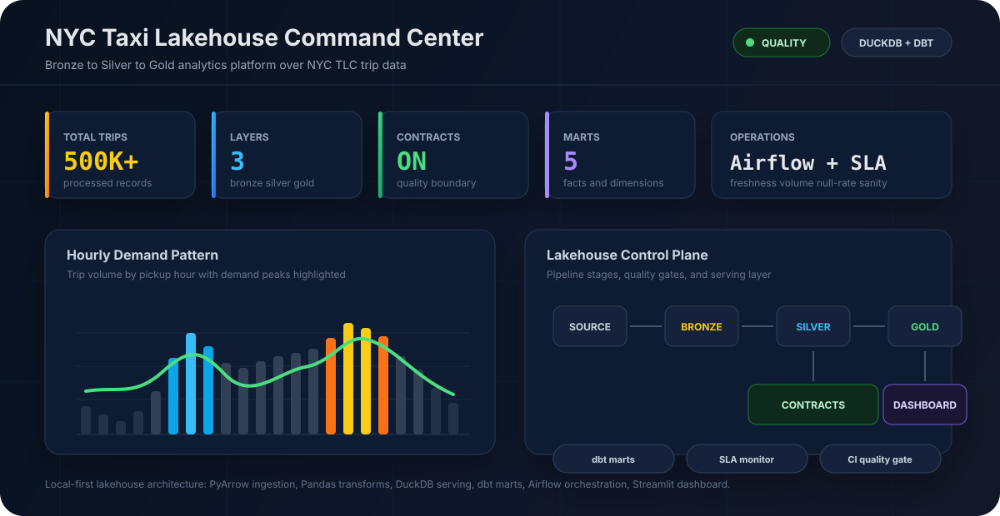
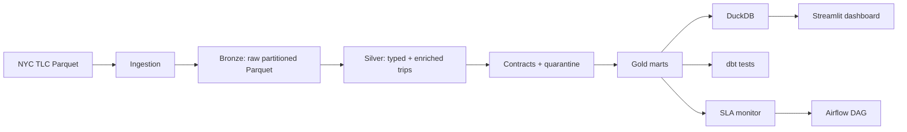

# NYC Taxi Lakehouse Command Center

[](.github/workflows/ci.yml)
[](requirements.txt)
[](models/)
[](pipeline/)
[](orchestration/dags/tlc_lakehouse_dag.py)

An end-to-end local lakehouse for NYC TLC Yellow Taxi data. The project converts raw trip records into governed analytical tables and serves them through a DuckDB-backed Streamlit command center.

The system is built around a practical production pattern: **ingest raw data, validate it, transform it into trusted analytical layers, monitor it, and expose it through a decision dashboard.**



## Command Center

The dashboard reads Gold-layer Parquet tables through DuckDB and presents the lakehouse as an operations cockpit.

| Panel | Purpose |
| --- | --- |
| KPI strip | Trip count, revenue, average fare, tip rate, distance, and payment mix |
| Hourly demand | Demand peaks by pickup hour with fare movement overlay |
| Borough revenue | Pickup-region revenue contribution and fare behavior |
| Daily trend | Volume and revenue stability across the processed period |
| Payment split | Credit card, cash, no-charge, dispute, and unknown payment profile |
| Speed by hour | Congestion pattern through average speed and trip duration |
| Fare distribution | Fare-shape inspection for outlier and rate-code behavior |

```bash
streamlit run dashboard/app.py
```

## Lakehouse Flow



## Platform Capabilities

| Area | Implementation |
| --- | --- |
| Ingestion | Public TLC Parquet extraction with PyArrow-based schema inspection |
| Storage | Local Parquet lakehouse with Bronze, Silver, and Gold layers |
| Transformation | Typed Python transforms for Silver and dbt SQL models for marts |
| Modeling | Fact and dimension tables for trips, hourly demand, dates, locations, and vendors |
| Quality | Contract checks for nulls, ranges, temporal order, duplicates, and business rules |
| Reliability | Idempotent stage design, quarantine outputs, SLA checks, and Airflow task boundaries |
| Observability | Freshness, volume, null-rate, future timestamp, date coverage, and revenue sanity checks |
| Delivery | Streamlit and Plotly dashboard over DuckDB views on Gold Parquet files |

## Data Products

| Table | Grain | Use |
| --- | --- | --- |
| `fct_trips` | One row per trip | Finance, trip analytics, payment behavior, airport/rate-code analysis |
| `fct_hourly_demand` | Pickup date x pickup hour x pickup zone | Demand heatmaps, operating rhythm, BI fast path |
| `dim_date` | One row per calendar day | Date joins, period filtering, weekday/weekend analysis |
| `dim_location` | One row per TLC location ID | Borough, service zone, airport, and Manhattan flags |
| `dim_vendor` | One row per vendor | Vendor labeling and reporting |

## Data Quality Gates

The Silver layer is treated as a contract boundary. Records are checked before they become dashboard-ready data.

| Check Type | Examples |
| --- | --- |
| Completeness | Required pickup/dropoff timestamps, fare fields, location IDs |
| Validity | Fare ranges, location ID ranges, payment type values |
| Temporal consistency | Dropoff timestamp must be after pickup timestamp |
| Business rules | Cash trips should not carry electronic tip amounts |
| Duplicates | Repeated trip signatures are surfaced |
| Distribution sanity | Average fare and distance are monitored for upstream drift |

## Operations

The Airflow DAG models a production-style schedule with clear task boundaries:

```text
wait_for_source
  -> check_already_processed
  -> extract_bronze
  -> transform_silver
  -> ge_data_contract
  -> dbt_run
  -> dbt_test
  -> dbt_source_freshness
  -> sla_volume_check
  -> write_success_marker
  -> notify_completion
```

## Quick Start

```bash
python -m venv .venv
source .venv/bin/activate  # Windows: .venv\Scripts\activate
pip install -r requirements.txt

python scripts/generate_test_data.py --rows 10000
python run_pipeline.py --stage all --source data/raw/yellow_tripdata_2024_q1.parquet

pytest tests/unit -q
pytest tests/integration -q

cd models
dbt run --profiles-dir .
dbt test --profiles-dir .

cd ..
streamlit run dashboard/app.py
```

## Repository Map

```text
ingestion/          Source extraction and schema validation
pipeline/           Bronze, Silver, and Gold transformation code
models/             dbt staging, intermediate, and mart models
monitoring/         Data contracts and SLA checks
orchestration/      Airflow DAG for scheduled execution
dashboard/          Streamlit command-center dashboard
scripts/            Synthetic data generator for demos and CI
tests/              Unit and integration tests
.github/workflows/  CI pipeline
```

## Dataset

The project targets NYC Taxi and Limousine Commission Yellow Taxi trip records:

https://www.nyc.gov/site/tlc/about/tlc-trip-record-data.page

For repeatable local runs and CI, [scripts/generate_test_data.py](scripts/generate_test_data.py) creates a synthetic dataset shaped like the TLC data, avoiding any dependency on large external downloads during review or testing.
