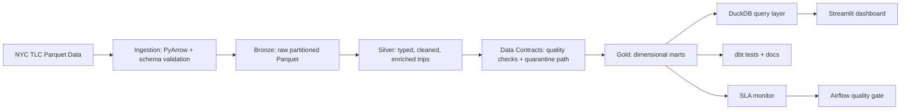

# NYC Taxi Lakehouse Command Center

[](.github/workflows/ci.yml)
[](requirements.txt)
[](models/)
[](pipeline/)
[](orchestration/dags/tlc_lakehouse_dag.py)

This repository is a **portfolio-grade data engineering command center** built on NYC TLC Yellow Taxi data. It turns raw Parquet trip records into governed analytics products through ingestion, medallion transformations, data contracts, dbt marts, SLA monitoring, CI gates, and a Streamlit dashboard.

It is designed to show the skills hiring teams actually inspect in 2026: not a notebook, not a toy ETL script, but a complete local-first data platform with reproducible data, testable transforms, analytical modeling, and operational controls.

## Platform Dashboard

| Signal | What This Repo Proves | Evidence |
| --- | --- | --- |
| Data platform design | Bronze, Silver, and Gold layers with clear ownership boundaries | [pipeline/](pipeline/) |
| Source ingestion | Public Parquet ingestion with schema validation and quarantine path | [tlc_extractor.py](ingestion/extractors/tlc_extractor.py) |
| Analytics engineering | dbt staging, intermediate, and mart models with schema tests | [models/](models/) |
| Data quality | Contract checks for nulls, ranges, temporal order, duplicates, and business rules | [silver_contract.py](monitoring/contracts/silver_contract.py) |
| Operational readiness | Airflow DAG with sensors, retries, quality gate, dbt tasks, and SLA checks | [tlc_lakehouse_dag.py](orchestration/dags/tlc_lakehouse_dag.py) |
| Observability | Freshness, volume, date coverage, null rate, and revenue sanity checks | [sla_monitor.py](monitoring/sla/sla_monitor.py) |
| Product delivery | Streamlit dashboard reading Gold tables through DuckDB | [dashboard/app.py](dashboard/app.py) |
| Engineering discipline | Unit tests, integration tests, CI workflow, linting, type checking, coverage gate | [tests/](tests/) |

## Executive Cockpit

| Product Area | Built Artifact | Hiring Signal |
| --- | --- | --- |
| Pipeline | Source -> Bronze -> Silver -> Gold | Can design batch data systems end to end |
| Modeling | `fct_trips`, `fct_hourly_demand`, `dim_date`, `dim_location`, `dim_vendor` | Understands dimensional modeling and BI access patterns |
| Quality | Silver contract runner plus dbt tests | Treats data quality as code, not manual inspection |
| Reliability | Idempotent stages, quarantine handling, SLA checks | Thinks like an operator, not only a developer |
| Analytics | Demand, revenue, fare, payment, speed, and borough metrics | Connects data infrastructure to business questions |
| Delivery | Streamlit command-center dashboard | Can turn pipelines into usable decision products |

## Dashboard Experience

The Streamlit dashboard is the visible product layer of the lakehouse. It reads directly from Gold Parquet tables through DuckDB and presents a city-scale operations view:

| Dashboard Panel | Business Question |
| --- | --- |
| KPI strip | How many trips, how much revenue, what fare/tip/distance profile? |
| Hourly demand | When does demand peak and how does fare behavior move by hour? |
| Borough revenue | Which pickup regions drive the strongest revenue? |
| Daily trend | Are trip volume and revenue stable across the period? |
| Payment split | How much demand is credit card, cash, dispute, or no-charge? |
| Speed by hour | Where do congestion and trip duration change through the day? |
| Fare distribution | Are fares shaped normally or affected by outlier/rate-code behavior? |

Run it after building the pipeline:

```bash
streamlit run dashboard/app.py
```

## System Architecture



## Data Product Layers

| Layer | Purpose | Technical Decisions |
| --- | --- | --- |
| Bronze | Preserve source data in an auditable format | Partitioned Parquet, append-safe writes, source schema checks |
| Silver | Produce trusted analytical records | Type casting, timestamp parsing, derived features, IQR outlier quarantine |
| Gold | Serve BI and dashboard use cases | Star schema, dimension tables, pre-aggregated hourly demand |
| Monitoring | Detect breakage before consumers do | Row count, freshness, null-rate, future timestamp, volume trend checks |
| CI | Keep the repo reviewable and reproducible | Unit tests, integration tests, dbt validation, quality gate, coverage target |

## Skill Map

| Skill Category | Demonstrated Through |
| --- | --- |
| Python data engineering | PyArrow ingestion, Pandas transforms, typed pipeline entrypoint |
| SQL analytics engineering | dbt staging, intermediate logic, marts, schema contracts |
| Lakehouse thinking | Medallion architecture, Parquet storage, Gold access layer |
| Data quality | Contract runner, dbt tests, business-rule validation, quarantine design |
| Orchestration | Airflow DAG, dependency graph, retries, sensors, branch logic |
| Observability | SLA monitor, freshness checks, volume trend checks, sanity checks |
| Dashboarding | Streamlit, Plotly, DuckDB-backed analytics views |
| Software engineering | Modular code, tests, CI, `.gitignore`, `.gitattributes`, reproducible setup |

## Quick Demo

```bash
python -m venv .venv
source .venv/bin/activate  # Windows: .venv\Scripts\activate
pip install -r requirements.txt

python scripts/generate_test_data.py --rows 10000
python run_pipeline.py --stage all --source data/raw/yellow_tripdata_2024_q1.parquet

pytest tests/unit -q
pytest tests/integration -q

cd models
dbt run --profiles-dir .
dbt test --profiles-dir .

cd ..
streamlit run dashboard/app.py
```

## Repository Map

```text
ingestion/          Source extraction and schema validation
pipeline/           Bronze, Silver, and Gold transformation code
models/             dbt staging, intermediate, and mart models
monitoring/         Data contracts and SLA checks
orchestration/      Airflow DAG for production-style scheduling
dashboard/          Streamlit command-center dashboard
scripts/            Synthetic data generator for demos and CI
tests/              Unit and integration tests
.github/workflows/  CI pipeline
```

## CV Positioning

Strong version:

> Built an end-to-end NYC Taxi lakehouse command center with schema-validated ingestion, medallion transformations, quarantine handling, dbt Gold marts, CI quality gates, SLA monitoring, Airflow orchestration design, and a DuckDB-backed Streamlit analytics dashboard.

Sharper senior version:

> Designed a production-style local lakehouse for NYC TLC data, combining PyArrow/Pandas ingestion, DuckDB/dbt analytical modeling, contract-based data quality, operational SLA checks, and dashboard-ready Gold tables for revenue, demand, geospatial, and payment analytics.

## Why This Is Not Just Another ETL Project

Most portfolio ETL projects stop at "load data and make a chart." This one shows the full surface area of a real data engineering role:

- Build reliable ingestion.
- Model data for consumers.
- Validate data before trust is assumed.
- Monitor freshness and volume.
- Keep transformations testable.
- Expose insights through a dashboard.
- Make the project reproducible for reviewers.

## Dataset

The project targets NYC Taxi and Limousine Commission Yellow Taxi trip records:

https://www.nyc.gov/site/tlc/about/tlc-trip-record-data.page

For repeatable local demos and CI, [scripts/generate_test_data.py](scripts/generate_test_data.py) creates a synthetic dataset shaped like the TLC data, so the project can be reviewed without downloading a large external file.
